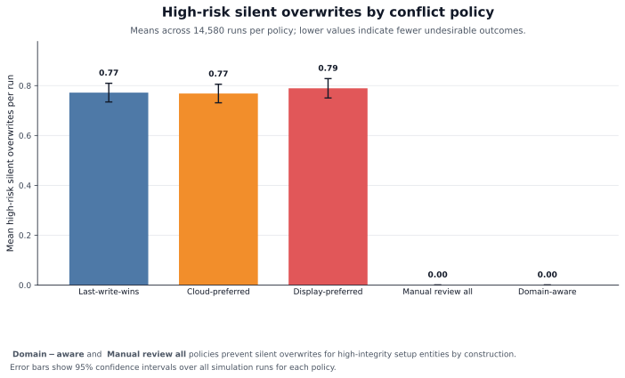
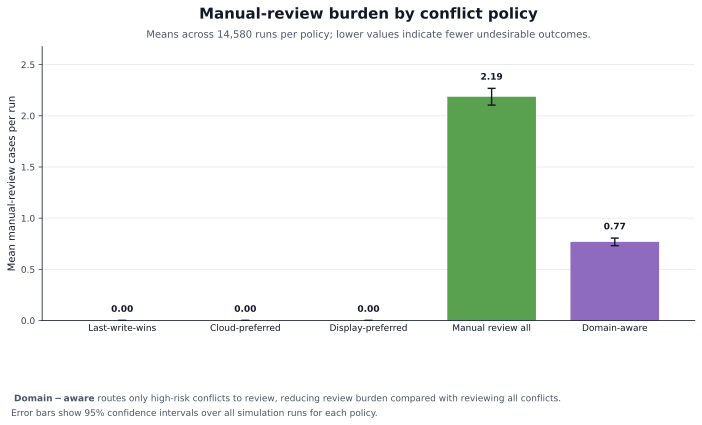
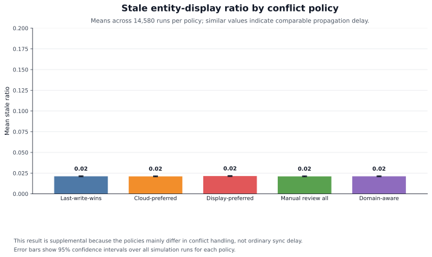

# Simulation Interpretation Guide

## What Problem Is the Simulation Studying?

Modern precision-agriculture systems may have:

- a cloud platform, such as a farm-management system,
- multiple machine displays in tractors or other equipment,
- setup data that needs to stay aligned across the cloud and displays.

Examples of setup data include:

- implement profiles,
- field boundaries,
- guidance tracks,
- products,
- operators,
- flags,
- tank mixes,
- varieties.

The problem is: **what happens when the cloud and a machine display both change related data before the system has fully synchronized?**

That creates a conflict.

The simulation asks:

> If conflicts happen, which synchronization policy best protects important agricultural setup data without forcing users to manually review everything?

## What the Code Is Doing

The code creates a simplified farm-data synchronization world. It does not simulate any real world software. It does not claim to know any vendor's internal implementation.

Instead, it creates many controlled "what-if" scenarios:

1. There is a cloud system.
2. There are several machine displays.
3. There are setup-data records, such as implements, boundaries, guidance tracks, products, and operators.
4. Some records are changed in the cloud.
5. Some records are changed on machine displays.
6. Sometimes displays are online.
7. Sometimes displays lose connection.
8. When connection returns, the system tries to synchronize changes.
9. If two versions of the same record changed before synchronization, the simulator treats that as a conflict.
10. The simulator applies different conflict-resolution policies and counts what happens.

## Why So Many Runs?

The canonical result set contains **72,900 policy-run rows**. That sounds large, but the reason is simple: the result does not depend on one selected scenario.

Instead, the code varies:

- number of displays,
- good/moderate/poor connectivity,
- fast/medium/slow sync intervals,
- low/medium/high update rates,
- low/medium/high conflict rates,
- different shares of high-risk setup data.

This makes the result stronger because it is not based on one hand-picked case.

The current version also makes policy comparisons paired. For each scenario and replication, the simulator creates one synthetic day and then runs every policy on that same set of events and connection outages. That makes the comparison stronger because the policies are being judged on the same simulated conditions.

## What Are the Policies?

The simulation compares five ways to handle conflicts.

### 1. Last-write-wins

Whichever change is newest wins.

Simple, but risky: an important change can be overwritten silently.

### 2. Cloud-preferred

If there is a conflict, the cloud version wins.

Simple, but display/operator changes may be lost.

### 3. Display-preferred

If there is a conflict, the machine display version wins.

Simple, but cloud/farm-manager changes may be lost.

### 4. Manual-review-all

Every conflict is sent to manual review.

Safest against silent overwrites, but creates more work for users.

### 5. Domain-aware

This is the policy we are proposing.

It treats agricultural data differently depending on risk:

- high-risk records, such as implement profiles, boundaries, and guidance tracks, go to manual review if there is a conflict;
- lower-risk records can use a simpler automatic rule.

This is the main idea:

> Not all farm setup data should be treated the same. Some records are important enough that silent overwrites should be avoided.

## What Are "High-Risk" Records?

High-risk records are setup data that can affect field operation quality.

In this simulation, high-risk records include:

- implement profiles,
- field boundaries,
- guidance tracks.

These entities are classified as high-risk because errors in implement profiles, field boundaries, or guidance tracks can propagate into downstream automation, documentation, and field-operation workflows. Public John Deere documentation specifically links implement-profile accuracy to AutoPath, AutoTrac Turn Automation, Section Control, work documentation, and boundary recording, and describes guidance lines as setup data that may need to be available to later operations soon after creation.

## What Does "Silent Overwrite" Mean?

A silent overwrite means:

1. one place changed a record,
2. another place also changed that record,
3. the system chose one version automatically,
4. the other version was lost,
5. no manual review happened.

For low-risk data, this may be acceptable sometimes.

For high-risk setup data, this is dangerous because the user may not realize that an important implement profile, boundary, or guidance track was overwritten.

## What Do the Results Say?

The main result is a trade-off:

> The domain-aware policy protects high-risk setup data like the review-everything policy, but it requires far fewer manual reviews.

The zero high-risk overwrite result is not a surprise. It happens because the domain-aware policy is designed to send every high-risk conflict to manual review. The important result is how much review work is needed to get that protection.

Compared with reviewing every conflict:

- domain-aware reduced total manual reviews by about **64.9%**.

Compared with last-write-wins:

- domain-aware reduced high-risk silent overwrites by **100%**,
- domain-aware reduced total silent overwrites by about **35.1%**.

In plain language:

> The proposed domain-aware policy gives high-risk setup data strong protection without making the user manually review every small conflict.

A robustness check also grouped the runs into **729 scenario cells**. Domain-aware handling had zero high-risk silent overwrites in every cell and never required more manual reviews than the review-everything policy. This is useful for the paper because it shows the result is not just a pooled-average artifact.

## Relationship to the Paper's Claims

The simulation supports the paper's claims when interpreted as a sensitivity analysis.

The simulation supports this claim:

> Precision-agriculture setup data has different integrity levels, and high-risk setup entities benefit from domain-aware conflict handling rather than generic last-write-wins synchronization.

The simulation also supports this claim:

> A synchronization architecture for agricultural displays and cloud platforms should distinguish high-risk setup entities from lower-risk administrative records.

The simulation does **not** claim:

- Any production vendor uses this exact event-log design.
- Real farms have exactly these conflict rates or outage durations.
- The simulation proves real-world field performance.

The supported framing is:

> The simulation evaluates policy behavior under transparent sensitivity scenarios.

## Manuscript Figure Files

The current SVG figures in `results/figures/` are the manuscript-ready figures generated from the canonical raw results. They include:

- clear titles,
- shortened policy names,
- axis labels,
- consistent colors,
- confidence-interval error bars.

## Figure 1: High-Risk Silent Overwrites

Figure file: `results/figures/figure_1_high_risk_silent_overwrites.svg`

What it shows:

- Each bar is one conflict-resolution policy.
- The height of the bar shows the average number of high-risk silent overwrites per simulation run.
- Lower is better.

How to interpret it:

- Last-write-wins, cloud-preferred, and display-preferred all allow high-risk silent overwrites.
- Manual-review-all has zero high-risk silent overwrites.
- Domain-aware also has zero high-risk silent overwrites.

Interpretation:

> Domain-aware protects high-risk agricultural setup data as well as manual-review-all. This happens by design, so the figure should be used together with the manual-review figure to show the trade-off.

Caption:

> Mean high-risk silent overwrites per simulation run across 14,580 runs per policy. Error bars indicate 95% confidence intervals. Domain-aware and manual-review-all policies prevent silent overwrites for high-integrity setup entities by routing high-risk conflicts to manual review.

## Figure 2: Total Manual Reviews

Figure file: `results/figures/figure_2_total_manual_reviews.svg`

What it shows:

- Each bar is one policy.
- The height shows how many total conflicts were sent to manual review.

How to interpret it:

- Last-write-wins, cloud-preferred, and display-preferred do not send conflicts to manual review.
- Manual-review-all sends every conflict to manual review.
- Domain-aware sends only high-risk conflicts to manual review.

Interpretation:

> This is the most important figure because it shows the cost of protection. Domain-aware gets the high-risk protection shown in Figure 1 while requiring far fewer reviews than manual-review-all.

Caption:

> Mean manual-review cases per simulation run across 14,580 runs per policy. Error bars indicate 95% confidence intervals. Domain-aware conflict handling requires substantially fewer manual-review interventions than manual-review-all while preserving zero high-risk silent overwrites.

## Figure 3: Stale Ratio

Figure file: `results/figures/supplement_stale_ratio.svg`

What it shows:

- The average amount of time displays had data that differed from the cloud.
- Lower is better.

How to interpret it:

- The policies have similar stale ratios.
- This means the main difference between policies is not basic synchronization delay.
- The main difference is how conflicts are handled.

Supplemental context:

This figure is best treated as supplemental context or a table note because stale ratios are similar across policies.

Caption:

> Mean stale entity-display ratio across the sensitivity sweep. Similar stale ratios across policies indicate that the primary distinction among policies is conflict-handling behavior rather than ordinary propagation delay.
